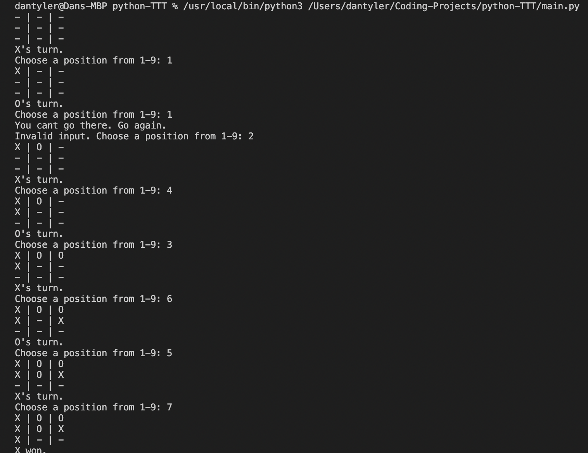

# Tic-Tac-Toe in Python

### Project overview

This project is a simple tic-tac-toe app built as an introduction to Python. The game can be played from the command line.

As this was my first python project, to help get to grips with a new language, I followed [this guide](https://www.youtube.com/watch?v=BHh654_7Cmw) as a tutorial.

### How to run the project

This project was created in VS Code and can be run in a few ways.

1. Running the path of python and the main.py file in the command line. Mine looks like this:
   /usr/local/bin/python3 /Users/dantyler/Coding-Projects/python-TTT/lib/main.py

2. Using the built in python play button in the top right of VS code.

### Project in action

